# Astros Technical Assessment

Goal: To parse through raw data received and identify a given pitcher's arm path during delivery, and provide up to two unique metrics to summarize the arm path.
___
# Pitcher: 680689
# Game: 429650
## Visualization of Raw Unprocessed Data
___

3D movement through time given four (4) joints, all corresponding to the pitcher's throwing arm side - hip (L/R), shoulder (L/R), elbow (L/R), wrist (L/R).

[3D Movements of Joints Overtime - Pre-Signal Processing](./images_and_output_data/pitcher_680689/uncleaned_3d_plot_.html)

___

2D movement through time - data remains uncleaned (pre-signal processing):

___

## Signal Processing Methodology - Density-Based Spatial Clustering of Applications with Noise (DBSCAN)
___
Implementation of a machine learning model known as DBSCAN. This is a density-based clustering non-parametric algorithm that groups given a set of points in a given nth dimensional space. It groups together points that are closely packed together, marking outliers in low density regions. 

In this study DBSCAN is applied to each coordinate per joint assessed and assessed independently per unit of time. As joint path over x, y, z coordinates is fluid over time, with no interruptions, DBSCAN per unit time allows for the model to identify continuous streams. Parameters epsilon (eps) and minimum  number of samples (min_samples) were manually adjusted to produce desired results. Noise can be seen as wider/fatter portions of the plots which primariliy presents itself towards the beginning (set position) and end (ball release position) of pitch delivery. If not explicitly identified, the default means to calculate distance between isntances in a feature array is via euclidean geometry (note that the metric to measure must be one of the options allowed by sklearn.metrics.pairwise_distances). Further parameters were not adjusted in this study but can be further reviewed to potentially further reduce noise. 2-dimensional plots of the cleaned data can be seen below:

    

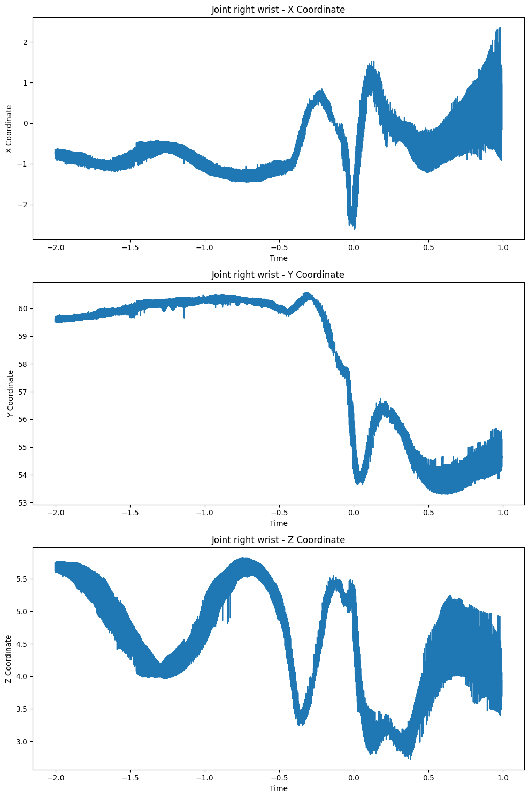

## Measured Metrics to Identify Arm Path
___
1. Curvature Over Time Profile measures how the bending or tuning of a path changes as an object or point moves. In turms of motion, cuvature can provide insight into the nature of movement.
    - Constant curvature indicates that the object is moving along a circular path with a fixed radius
    - Changing curvature over time indicates that the object's path is bending or turning at varying rates.
    - Zero curvature indicates that the object is moving in a straight line.

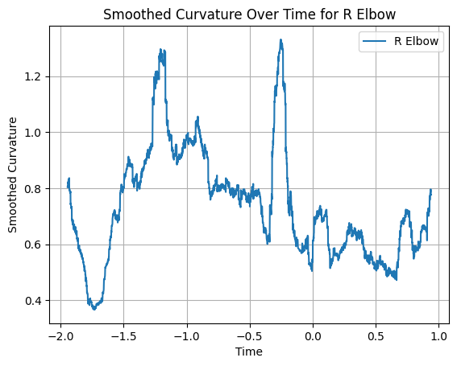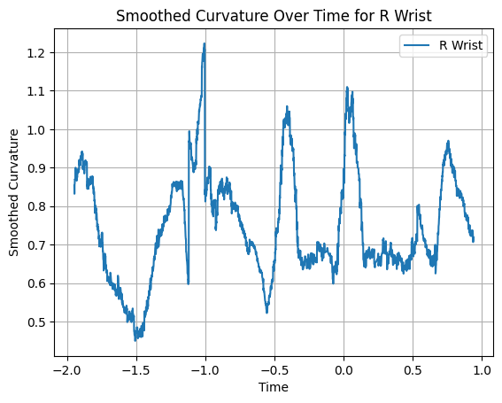

2. Velocity Over Time Profile measure how the speed and direction of an object's movement change as it travels along its path. A more basic metric, but possible to identify differences as pitch count increases.

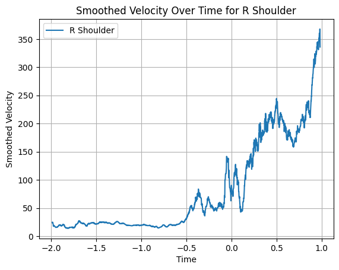

3. Cumulative Distance Traveled provides a quantitative measure of how much the arm/joint ha smoved during the entire pitch delivery. Through this one can gain possibly insights to the efficiency and mechnics of pitching motion. This could also possibly be used to identify any mechcanil differences in a pitchers delivery, potentially identifying injury, strain, or fatigue. (note all joints have been placed in one plot)

4. Aggregate Mean Path tracks the joint path through time and computes the mean for all samples per time increment. Once the mean path is computed a tolerance can then be set to allow for normal deviations in pitch delivery. If the delivery starts to fall outside of the "pocket" then further investigation may be needed.

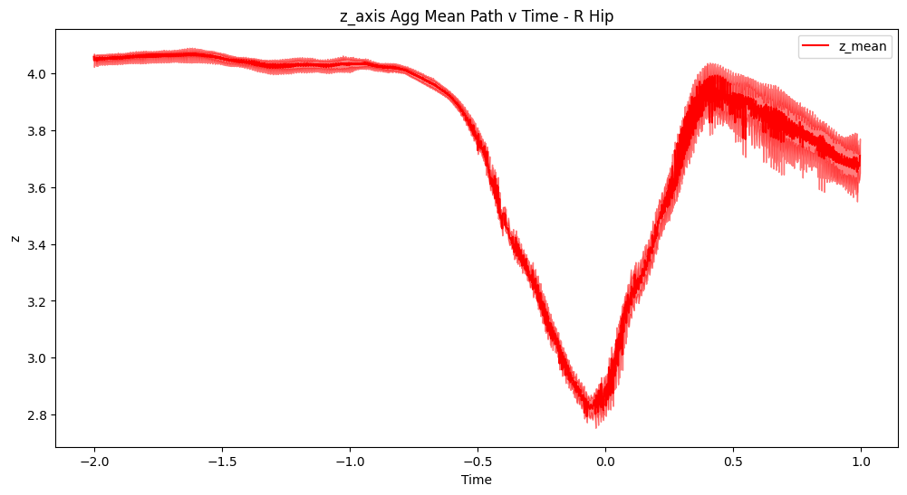

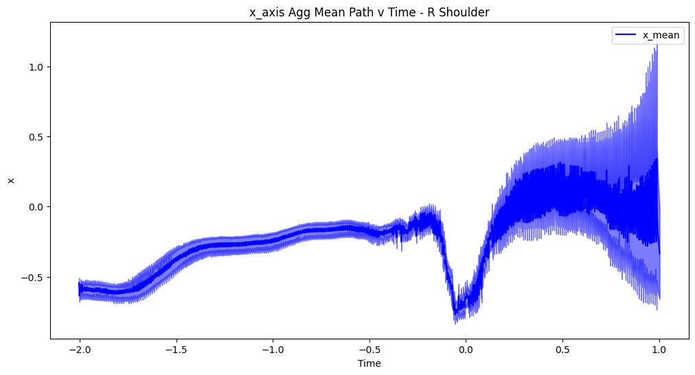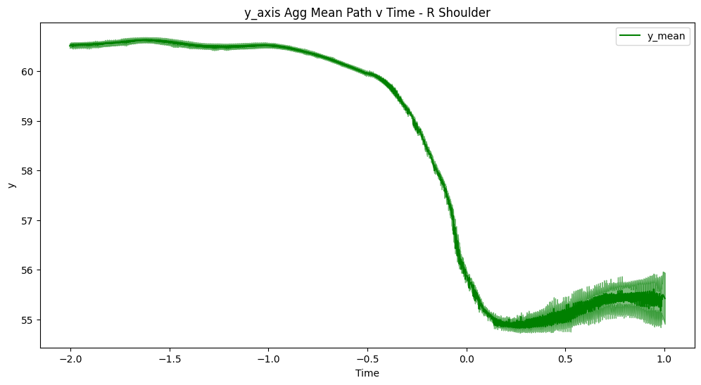

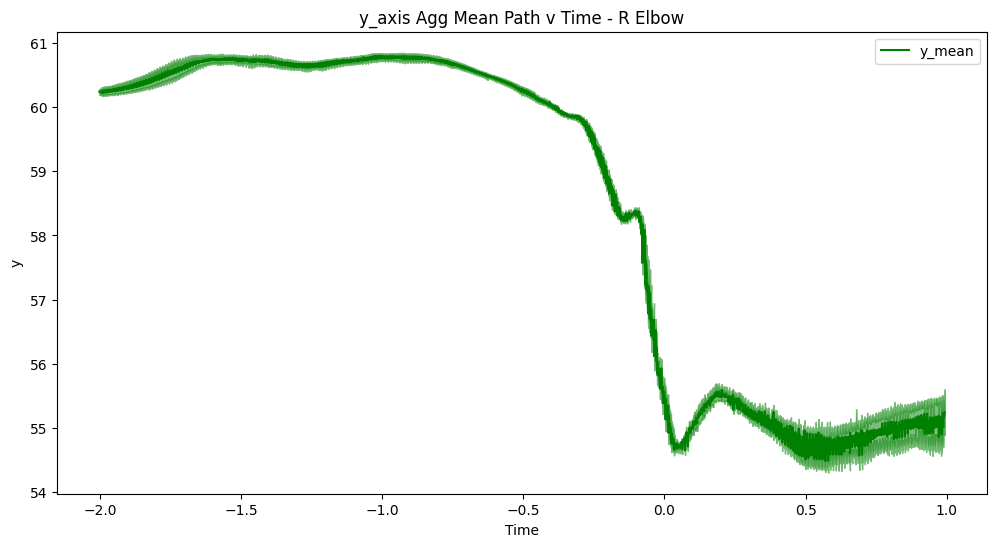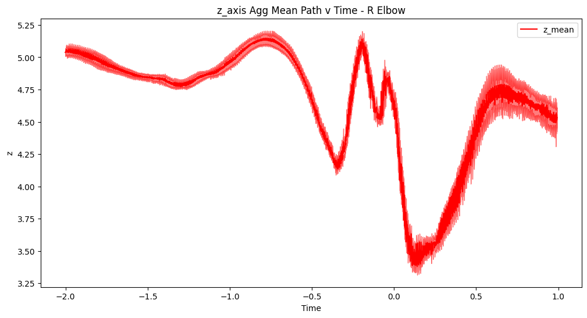

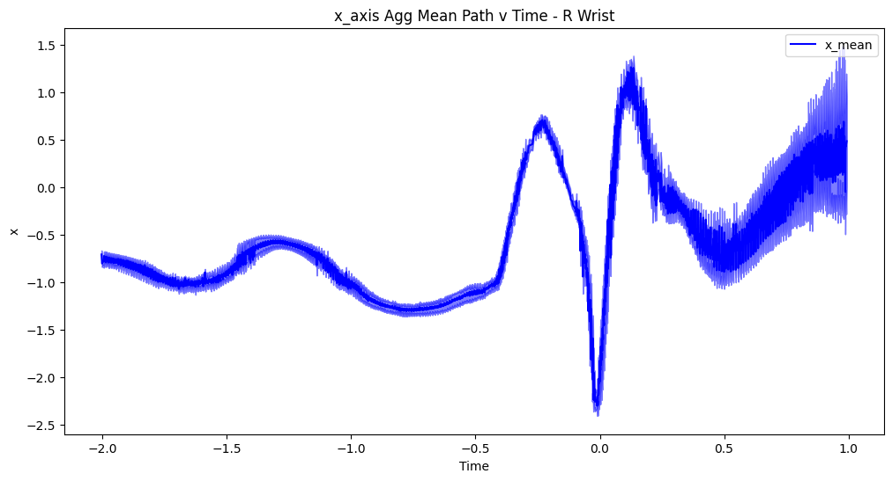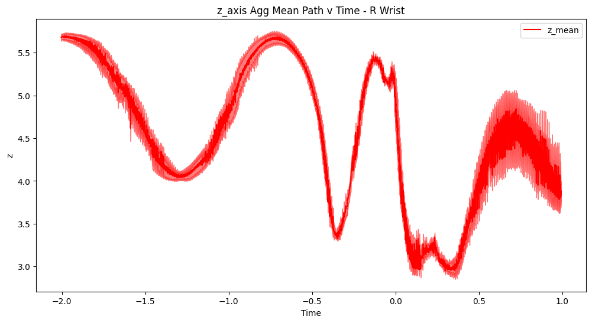