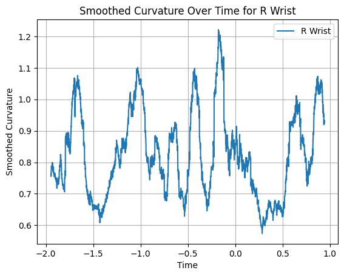
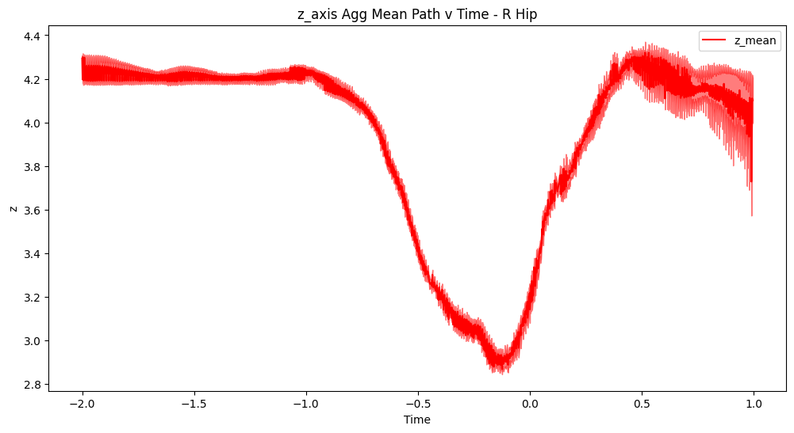
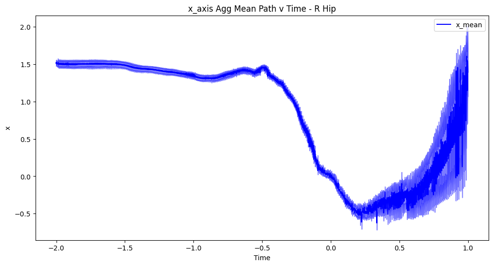
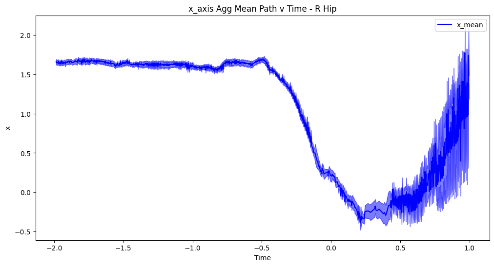
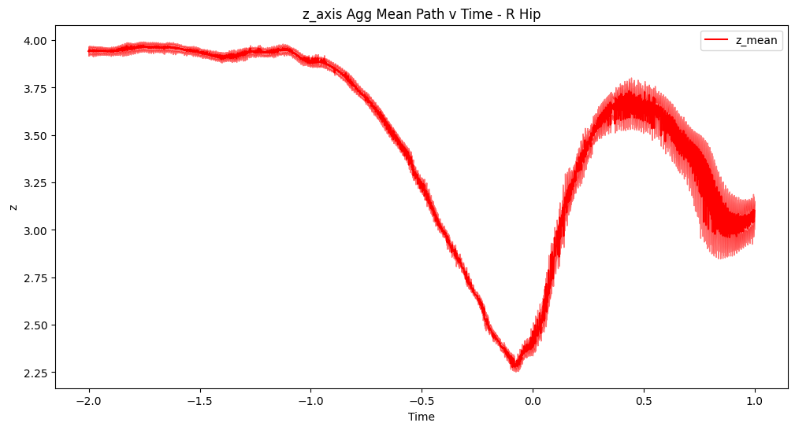

# Astros Technical Assessment - Pitcher Comparative Study

This document is to review and compare the various pitcher data that was provided on 26FEB2024 as a technical assessment for the Perforamance Engineer Role with the Houston Astros Organization.
___
___
___
## Raw and Cleaned/Processed Data
Raw and processed data can be independently reviewed per pitcher and game in each respective pitcher report that is organized by pitcher identification number - "README_pitcher_{pitcher_id}.md". This documentation has also been provided in *.pdf formatting for ease of review.

## Signal Processing Methodology - Density-Based Spatial Clustering of Applications with Noise (DBSCAN)
Details concerning DBSCAN implementation is outlined in each individual pitcher report.

## Measured Metrics to Identify Arm Path
Full details concerning each metric are outlined in each individual pitcher report.

## Observations
Review of the metrics below identify that Aggregate Mean Path, Total Path, Cumulative Distance Traveled per Joint, Curvature Profile and Velocity Profile differ significantly from pitcher to pitcher. Further, in review of Pitcher 669302 comparing games Sched 429650 and Sched 430322 all metrics show visually identical profiles and plots. 

However, in review of Pitcher 554430 when comparing Sched 429722 and Sched 429804 there are clear differences between Sched metrics. Joint Curvature Profiles are very different, showing that the rate of change of direction along curved movements is impacted greatly. Review of Joint Velocity Profiles also shows significant differences, identifying significantly lower velocities for all reviewed joints at ball release (time = 0) for Sched 429722. Total path length between both Sched's for the pitcher are also notably different. Though review of Aggregate Mean Path does not, at a quick glance, identify significant differences, there is some mutia that can be considered different. At -0.5 seconds there is a sharp dip along the x-axis of the right elbow in Sched 429804 that is slightly smoother in Sched 429722. Review of the Aggregate Mean Path along the z-axis for all joints also shows about 0.25 greater values along the entire path for Sched 429804 than Sched 429722.

___
___
___
### 1. Curvature Over Time Profile

 
Pitcher 669302 - Sched 429650

Pitcher 669302 - Sched 430322

Pitcher 680689 - Sched 429650

Pitcher 554430 - Sched 429722

Pitcher 554430 - Sched 429804

Pitcher 642547 - Sched 429722

Pitcher 641712 - Sched 429804

Pitcher 543243 - Sched 430322

___
___
___

### 2. Velocity Over Time Profile

Pitcher 669302 - Sched 429650

Pitcher 669302 - Sched 430322

Pitcher 680689 - Sched 429650

Pitcher 554430 - Sched 429722

Pitcher 554430 - Sched 429804

Pitcher 642547 - Sched 429722

Pitcher 641712 - Sched 429804

Pitcher 543243 - Sched 430322

___
___
___
### 3. Cumulative Distance Traveled per Joint

Pitcher 669302 - Sched 429650 (L) & 430322 (R)

Pitcher 680689 - Sched 429650

Pitcher 554430 - Sched 429722 (L) & 429804 (R)

Pitcher 642547 - Sched 429722

Pitcher 641712 - Sched 429804

Pitcher 543243 - Sched 430322

### 4. Aggregate Mean Path

Pitcher 669302 - Sched 429650

Pitcher 669302 - Sched 430322

Pitcher 680689 - Sched 429650

Pitcher 554430 - Sched 429722

Pitcher 554430 - Sched 429804

Pitcher 642547 - Sched 429722

Pitcher 641712 - Sched 429804

Pitcher 543243 - Sched 430322

